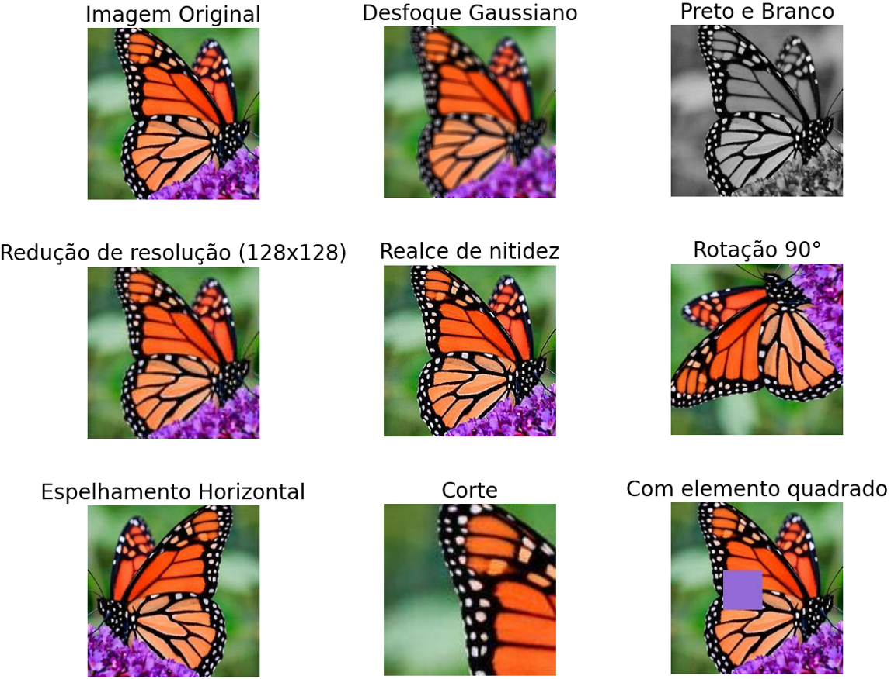

# Busca Reversa de Imagens : CNN, DCT e LSH

Repositório de experimentos e implementação de algoritmos de busca reversa de imagens.



É proposto a comparação no campo de busca reversa de imagens entre os algoritmos: CNN, DCT e LSH.

- DCT: A Transformada Discreta de Cosseno (DCT) é uma técnica utilizada no hash perceptivo que converte dados do dominio do espaço para o dominio da frequencia. 

- LSH: O Hash Sensível à Localidade (LSH) é um algoritmo de particionamento de dados, limitando o espaço de busca e os representando em uma menor dimensão.

- CNN: As Redes Neurais Convolucionais (CNNs) são uma arquitetura de rede neural projetada para processar dados em grade, como imagens.

## Uso

- Se quiser colocar seu próprio banco de imagens:
    - Coloque as imagens em uma pasta chamada "original_images"
    - Rode o script `variacoes_imagens.py`, este irá criar as imagens com as variações desejadas e colocar na pasta "images"
    - No arquivo `cnn.py` rode a função `extract_and_save_features()`. Esta função irá gerar os arquivos .npy na pasta `features`, armazenando os vetores de características das imagens.
- Para executar o experimento, rode o script `experimentos.py`.
    - Ele ira executar a busca nos tres possiveis algoritmos: CNN, DCT e LSH.
    - Será plotado um grafico comparando os resultados do experimento entre as técnicas propostas.

## Instalação

Para instalar as dependências necessárias, utilize o arquivo `requirements.txt`:

```bash
pip install -r requirements.txt
```
